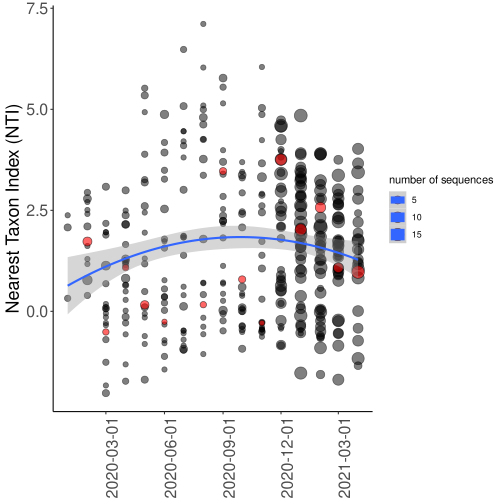
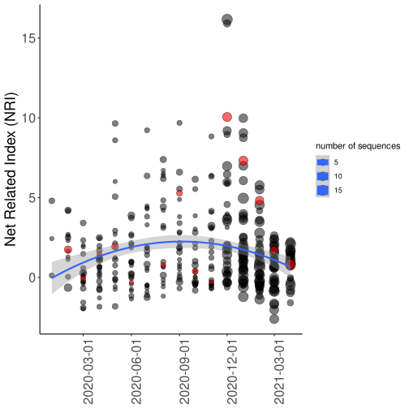
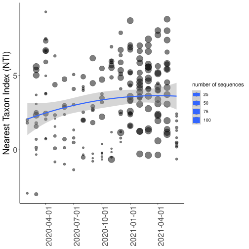
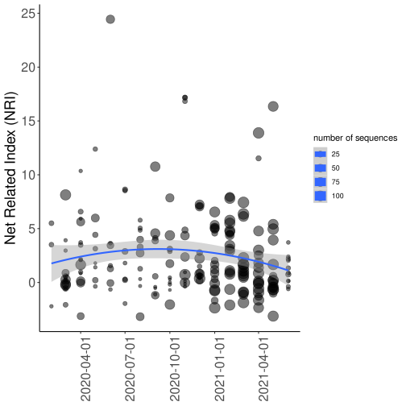

#  COVID community phylogenetics metrics

The COVID-19 pandemic provides an unprecedented opportunity to develop and test new metrics and methods for spotting disease outbreaks. Can classic metrics of ecological community structure (specifically, MPD and MNTD) tell us anything useful about how the COVID variants have spread through time and could these be a useful addition to traditional phylogenetic tools in studying outbreaks? 

## Preliminary work with NextStrain

To re-calculate the community phylogenetic metrics, run: ```Rscript src/phylo_shape.R``` to re-create the plots, run: ```Rscript src/phylo_results.R```.

I downloaded the NextStrain Europe tree and metadata as a starting point (see nextstrain_ncov_europe_timetree_20210426.tre and nextstrain_ncov_europe_metadata_20210426.tsv). I then binned the phylogeny by date into months and calculated mpd and mntd for each country across each month using pez. 

From pez, '.obs.z' is the Standardised effect size; mpd.z = -NRI; mntd.z = -NTI. (NRI = "Net related index", NTI = "Nearest taxon index").

 * clustering = more species per genus than expected = positive NRI & NTI
 * overdispersed = less species per genus than expected = negative NRI & NTI

Plotting these through time for the Europe data shows a (possibly interesting?) hump-shaped pattern of increasing then decreasing clustering through time.





Each point is a country. Red points picked out are the UK, just out of interest. Increasing size of points shows number of sequences in the tree for that country. This is not even through time, the NextStrain methodology samples more sequences closer to the current date.

## Preliminary work with in-house phylogeny

The NextStrain tree is big, but covers so many countries that there can be quite few sequences per country for each month. Also the uneven sampling through time doesn't seem ideal.

We decided to focus down more on a single country and see if the same pattern comes out in the data. We picked Germany as this has had a large amount of sequencing effort, and it has a decent amount of sub-divisions (16 provinces) that the GIDAID sequences are located to in the metadata (the UK isn't as good on this front, because sequences in GISAID are only subdivided into England/Scotland/Wales/NI). 

Manon Ragonnet-Cronin from the phylodynamics team investigating COVID at Imperial generated a giant dated tree of Germany for this with 11,000 sequences, relatively evenly sampled through time.

Doing the same process on this new tree gives similar (?) results, if not quite so obviously hump-shaped. This time each point is a different German province.





Whats driving these differences in community structure through time?